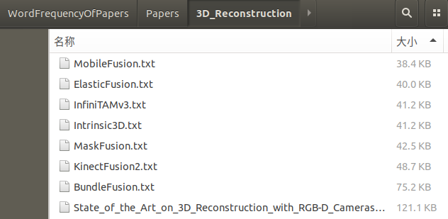

看英语论文的时候，总有些不认识的单词扎眼睛。突发奇想，写个脚本把多篇论文里单词的词频统计出来，然后有针对性地背出现次数多、不认识的单词不就好了吗？这样不仅可以快速减少扎眼睛的单词，如果论文都是来自同一领域，还可以一定程度上快速了解这个领域，完美！


# 创建词典

将每一篇论文的文本（txt格式），放在一个文件夹下面。推荐不要将reference的内容也复制到txt中，因为reference里面有很多的人名。存放的文件夹可以是自己创建的，也可以使用根目录下面的`./Papers`（里面有我放的一些东西，用作示例，可以自己删了）。文件夹下可以有子目录，脚本会自动递归找出所有txt文件。**注意文件夹和文件名中不能出现空格**。比如我是这么放的：



然后运行脚本`count.sh`

```shell
bash count.sh
```

脚本运行后，会让你输入论文的txt所在路径，如果前面是自己创建文件夹的话，输入那个文件夹的路径，否则直接回车，使用默认路径`./Papers`。脚本执行完后会告诉你字典文件的名字，格式为`dictionary_*.txt`，`*`为输入文件夹的名称。

脚本进行单词筛选的策略如下


# 维护黑名单

可以将自己已经认识的单词放入黑名单中，前面统计出来的词典不会包含黑名单中的单词。由于脚本`count.sh`会将对黑名单依次进行下图操作，所以扩充黑名单的时候用户有一定的自由性，可以添加一段文字也可以从词典中整行整行地复制过来。


> 文本处理python和c++都是垃圾